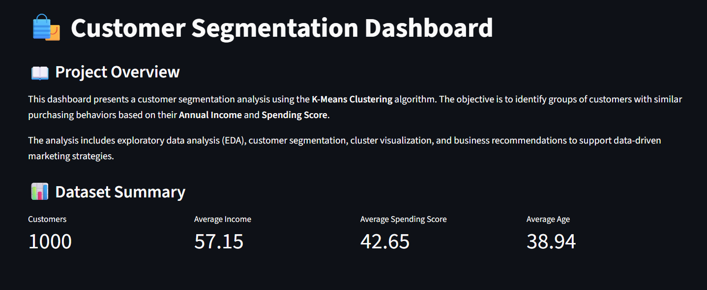
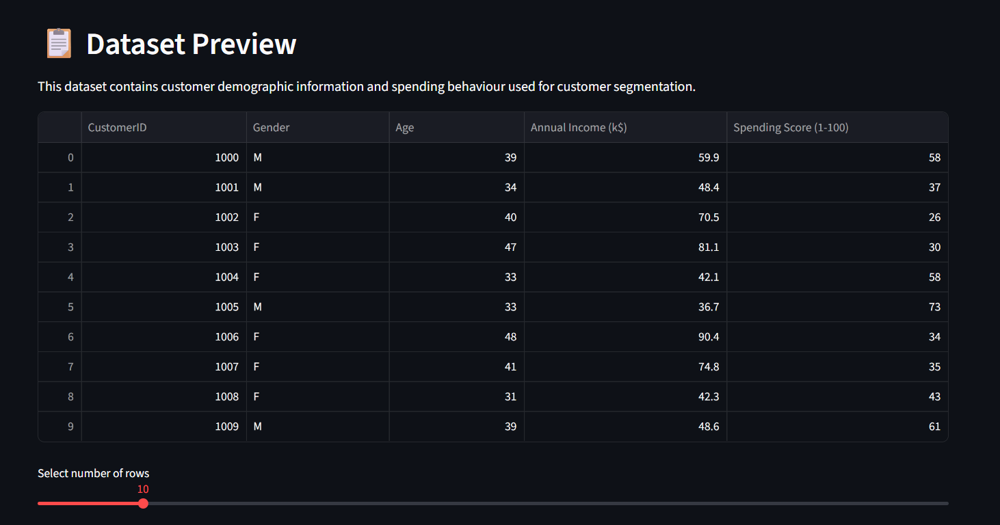
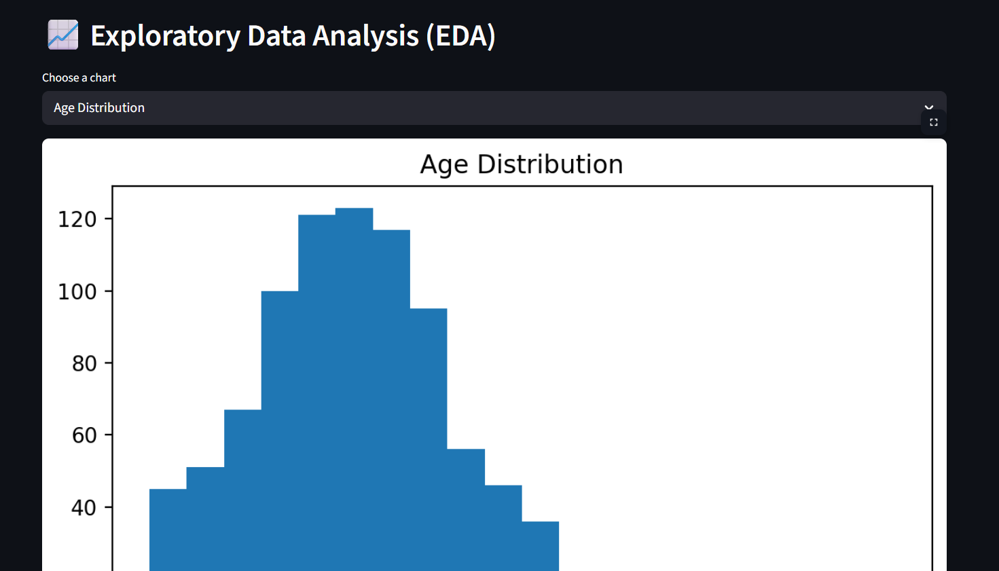
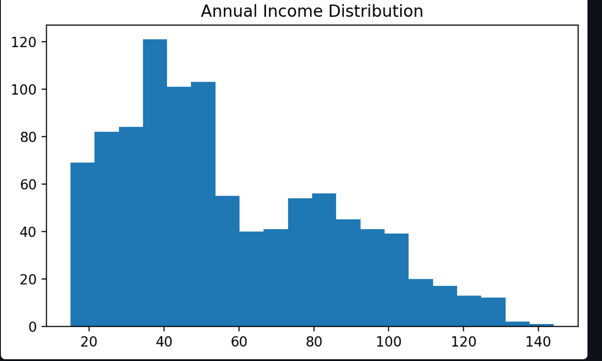
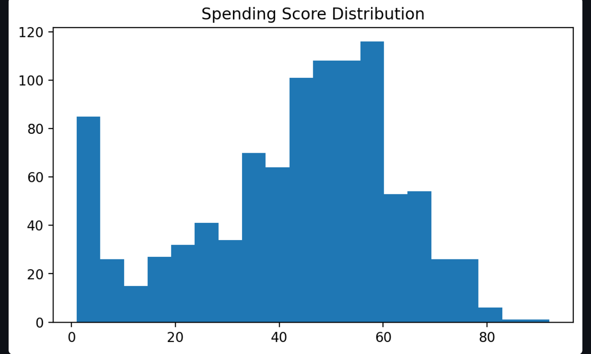
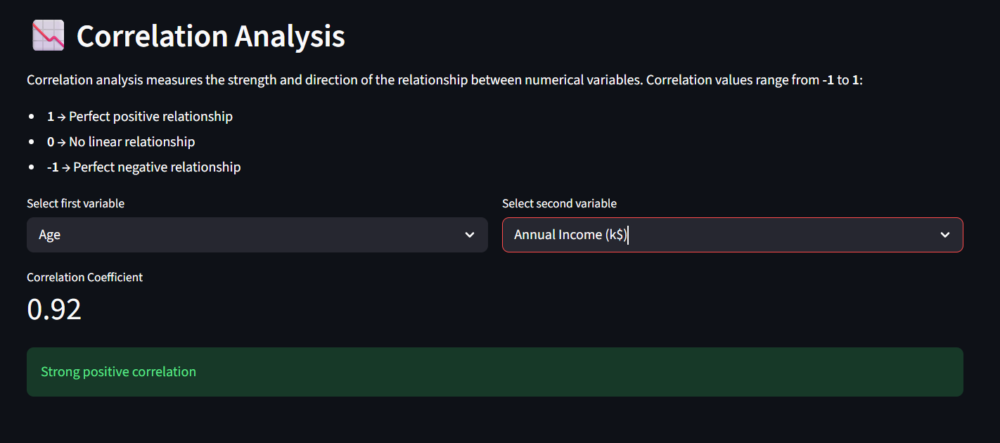
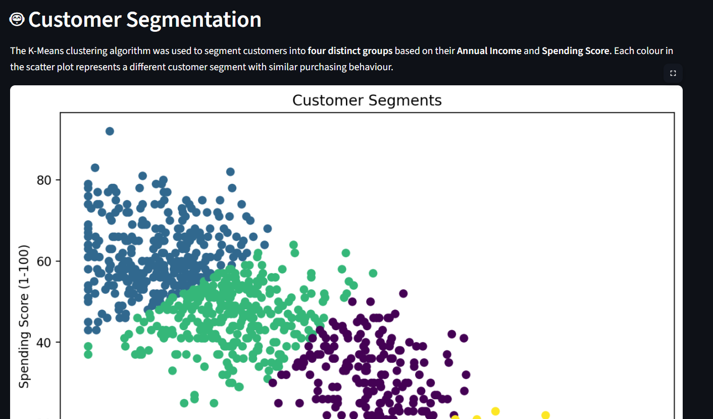
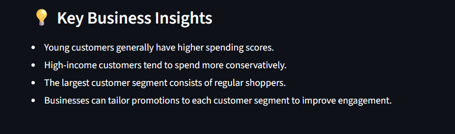

# Customer Segmentation Dashboard

A professional and interactive Streamlit dashboard for analyzing customer behavior and grouping customers into meaningful segments using K-Means clustering.

This project demonstrates how data science and machine learning techniques can be used to uncover customer patterns from demographic and spending data, making it valuable for marketing, customer retention, and business strategy.

## Overview

The dashboard helps users:
- explore customer data through an interactive interface
- analyze distributions and relationships between variables
- perform correlation analysis on numerical features
- segment customers into clusters based on annual income and spending score
- gain business-oriented insights from the results

## Key Features

- Responsive Streamlit web app with multiple analytical views
- Dataset preview and basic data quality checks
- Exploratory data analysis (EDA) with charts for age, income, and spending patterns
- Correlation analysis for numerical variables
- Customer segmentation using K-Means clustering
- Visual cluster summary and business recommendations

## Tech Stack

- Python
- Streamlit
- Pandas
- Matplotlib
- Seaborn
- Scikit-learn

## Project Structure

```text
customer-segmentation/
├── app.py                 # Main Streamlit application
├── data/
│   └── store_customers.csv
├── images/
│   └── banner.png
├── notebook.ipynb         # Optional exploratory notebook
├── requirement.txt        # Python dependencies
└── README.md              # Project documentation
```

## Screenshots

### Dashboard Overview


### Dataset Preview


### Exploratory Data Analysis - Age


### Exploratory Data Analysis - Annual Income


### Exploratory Data Analysis - Spending Score


### Correlation Analysis


### Customer Segmentation


### Business Insights


### Application Banner


## Dataset

The project uses a customer dataset containing fields such as:
- Customer ID
- Gender
- Age
- Annual Income (k$)
- Spending Score (1-100)

These features are used to identify segments of customers with similar purchasing behavior.

## Installation

1. Clone the repository:

```bash
git clone <repository-url>
cd customer-segmentation
```

2. Create and activate a virtual environment:

```bash
python -m venv .venv
.venv\Scripts\activate
```

3. Install the required dependencies:

```bash
pip install -r requirement.txt
```

## Run the Application

Start the dashboard locally with:

```bash
streamlit run app.py
```

Then open the local URL shown in the terminal in your browser.

## Usage

The app includes the following sections:
- Overview: project summary and key metrics
- Dataset: preview and data information
- EDA: visual exploration of customer attributes
- Correlation Analysis: examine variable relationships
- Customer Segmentation: cluster customers into groups
- Business Insights: actionable recommendations

## Business Value

This project is useful for:
- understanding customer profiles
- improving targeted marketing campaigns
- identifying high-value customer groups
- supporting data-driven business decisions

## Notes

The segmentation model uses four clusters and focuses on two core features: annual income and spending score. The results can be extended further with additional variables such as purchase frequency, region, or customer lifetime value.
